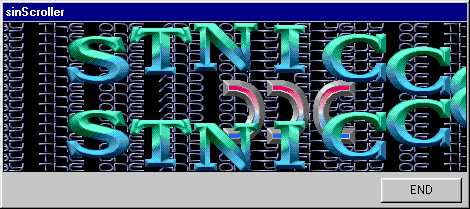



## Sinus Scroller

### Description

Just for fun, showing some old-skool demo effects.
 
### More Info
 
You like to watch demo's, normally written in assembler or C

Lot's of fun... -)

When you quit the application, the walls seem to be moving

             |
---                |---
**Submitted On**   |2000-08-14 20:47:34
**By**             |[Arnout de Vries](https://github.com/Planet-Source-Code/PSCIndex/blob/master/ByAuthor/arnout-de-vries.md)
**Level**          |Intermediate
**User Rating**    |5.0 (20 globes from 4 users)
**Compatibility**  |VB 5\.0, VB 6\.0
**Category**       |[Graphics](https://github.com/Planet-Source-Code/PSCIndex/blob/master/ByCategory/graphics__1-46.md)
**World**          |[Visual Basic](https://github.com/Planet-Source-Code/PSCIndex/blob/master/ByWorld/visual-basic.md)
**Archive File**   |[CODE\_UPLOAD89558142000\.zip](https://github.com/Planet-Source-Code/arnout-de-vries-sinus-scroller__1-10684/archive/master.zip)

